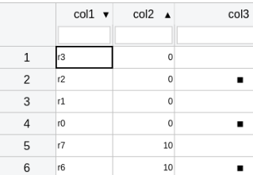
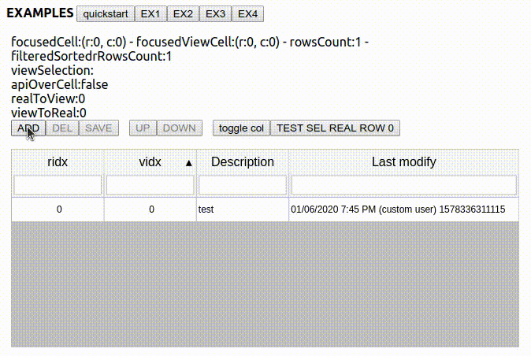

# react ws canvas

[](https://www.npmjs.com/package/react-ws-canvas) [](https://standardjs.com)

Spreadsheet like react canvas datagrid optimized for performance built entirely typescript and react functional components with react hooks.

[**LIVE DEMO**](https://codesandbox.io/s/github/devel0/react-ws-canvas/tree/master/example)

---

- [recent changes](#recent-changes)
- [features](#features)
- [todo](#todo)
- [quickstart](#quickstart)
- [examples list](#examples-list)
- [tips](#tips)
- [how to contribute ( quickstart )](#how-to-contribute--quickstart-)
- [local deploy](#local-deploy)
- [how this project was built](#how-this-project-was-built)
- [development notes](#development-notes)

---

## recent changes

- v0.23.4
  - added margin when wrap custom rendere objects
- v0.23.3
  - fix recompute row height for custom render els
- v0.23.2
  - changed customRender, customEdit signature to allow return undefined ; added autoresize height for customRender elements ( when wrapText enabled )  
- v0.23.1
  - handle wheel on custom render

## features

- **canvas based** high performance datagrid ( able to scroll with ease millions of rows maintaining immediate cell focus and editing features )

50000 rows x 200 cols example ( [LIVE EXAMPLE](https://codesandbox.io/s/github/devel0/react-ws-canvas/tree/master/example) : click *EX1* button )


- **direct cell editing**, just click on a cell then type, hit ENTER or arrows keys to move next ( [native cell types][1] )
  - "text": type text to change cell ; CANC to clear cell ; CTRL+C / CTRL+V to copy/paste
  - "boolean": toggle boolean with keyboard space when cell focused
  - "date", "time", "datetime": smart date insertion ( typing 121030 results in 12/10/2030 ) browser locale supported
  - "number": sci numbers ( typing 12e-3 results in 0.012 displayed ) browser locale support for decimal separators

- [properties default values][22]

- [cell or row][2] selection mode


- selection [mode multi][9]


- frozen [rows, cols][3]


- [wrap][21] text cells ( [helper][121] )


- rows and cols numbering can be [shown or hidden][5]

- if column numbering visible automatic sort can be customized through [less-than-op][6] ( [helper][106] )

- [column click behavior][12] can be full column select, column toggle sort or none to disable sort/select behavior

- [column header][15] can be customized ( [helper][115] )

- canvas size can be specified through width, height ( [fullwidth][26] option available )

- column width can be changed intractively using mouse


- column width [autoexpand][16]

- column custom [initial sort][18] ( *note*: prepareCellDataset, rowSetCellData, commitCellDataset must defined to make sort working ); also see [example6][36] for tip about ensure initial sort on subsequent datasource applications



- data getter/setter can follow a [worksheet][7] or a [db record type][8] ( [example of nested field][28] using [getFieldData][29] and [setFieldData][30] methods)

- data [filter global][129]

- optional dataset on external object with [ds rows getter mapper][32] useful in some circumstance when need to preserve rows array object ref

- [api][10] and [handlers][27] available for control interactions ( [example][11] ) ; props can be accessed [inversely][31] through api; retrieve list of selected row idxs [example][38]



- each individual cell [custom edit][13] ( F2 ) control can be customized also in [column helper][113] ( [example][24] : through keyboard F2, arrows then enter ) ; cell [editing/edited][128] also in [column helper][127]


- custom multi select with material-ui ( [example][35] )

- custom date picker with material pickers ( [example][37] )


- custom color picker with **custom render** ( [example][130] ) ; note: wrapText will use custom component height to *autoresize row height* ; *filter* can work as text mode defining renderTransform


- cell [background][19], [font and color][119], [readonly mode][126] customization and [text align][25] also with [helper][125]


- container [height min][23] and canvas [styles][20]

- each individual [cell type][14] can be customized ( [column helper][114] )

- clipboard copy to/from spreadsheet with ctrl-c and ctrl-v or [api][34] ( [example api][33] )


- support mobile touch scrolling rows, cols and scrollbars

[1]: https://github.com/devel0/react-ws-canvas/blob/513632060951df8a20b83dee39667529cc0ac883/example/src/lib/WSCanvasColumn.tsx#L7
[2]: https://github.com/devel0/react-ws-canvas/blob/513632060951df8a20b83dee39667529cc0ac883/example/src/lib/WSCanvasProps.tsx#L45
[3]: https://github.com/devel0/react-ws-canvas/blob/513632060951df8a20b83dee39667529cc0ac883/example/src/lib/WSCanvasProps.tsx#L38-L41
[5]: https://github.com/devel0/react-ws-canvas/blob/513632060951df8a20b83dee39667529cc0ac883/example/src/lib/WSCanvasProps.tsx#L50-L55
[6]: https://github.com/devel0/react-ws-canvas/blob/513632060951df8a20b83dee39667529cc0ac883/example/src/lib/WSCanvasProps.tsx#L90-L91
[106]: https://github.com/devel0/react-ws-canvas/blob/513632060951df8a20b83dee39667529cc0ac883/example/src/lib/WSCanvasColumn.tsx#L36-L37
[7]: https://github.com/devel0/react-ws-canvas/blob/cbd9d6d75100a45cb7d0ee073c6d5ab03f3a354e/example/src/Sample1.tsx#L31-L35
[8]: https://github.com/devel0/react-ws-canvas/blob/e893299287fd041f84e900262d5915bf8670fc6b/example/src/Sample4.tsx#L231-L240
[9]: https://github.com/devel0/react-ws-canvas/blob/513632060951df8a20b83dee39667529cc0ac883/example/src/lib/WSCanvasProps.tsx#L42-L43
[10]: https://github.com/devel0/react-ws-canvas/blob/53639eb02d4df298b4591c6f231c63cf4db703b2/example/src/lib/WSCanvasApi.tsx#L13
[11]: https://github.com/devel0/react-ws-canvas/blob/e893299287fd041f84e900262d5915bf8670fc6b/example/src/Sample4.tsx#L150
[12]: https://github.com/devel0/react-ws-canvas/blob/513632060951df8a20b83dee39667529cc0ac883/example/src/lib/WSCanvasProps.tsx#L58-L59
[13]: https://github.com/devel0/react-ws-canvas/blob/513632060951df8a20b83dee39667529cc0ac883/example/src/lib/WSCanvasProps.tsx#L85-L87
[113]: https://github.com/devel0/react-ws-canvas/blob/513632060951df8a20b83dee39667529cc0ac883/example/src/lib/WSCanvasColumn.tsx#L57-L58
[14]: https://github.com/devel0/react-ws-canvas/blob/513632060951df8a20b83dee39667529cc0ac883/example/src/lib/WSCanvasProps.tsx#L92-L93
[114]: https://github.com/devel0/react-ws-canvas/blob/513632060951df8a20b83dee39667529cc0ac883/example/src/lib/WSCanvasColumn.tsx#L22-L23
[15]: https://github.com/devel0/react-ws-canvas/blob/513632060951df8a20b83dee39667529cc0ac883/example/src/lib/WSCanvasProps.tsx#L88-L89
[115]: https://github.com/devel0/react-ws-canvas/blob/513632060951df8a20b83dee39667529cc0ac883/example/src/lib/WSCanvasColumn.tsx#L25-L26
[16]: https://github.com/devel0/react-ws-canvas/blob/513632060951df8a20b83dee39667529cc0ac883/example/src/lib/WSCanvasProps.tsx#L34-L35
[18]: https://github.com/devel0/react-ws-canvas/blob/513632060951df8a20b83dee39667529cc0ac883/example/src/lib/WSCanvasProps.tsx#L96-L97
[118]: https://github.com/devel0/react-ws-canvas/blob/513632060951df8a20b83dee39667529cc0ac883/example/src/lib/WSCanvasColumn.tsx#L44-L48
[19]:https://github.com/devel0/react-ws-canvas/blob/513632060951df8a20b83dee39667529cc0ac883/example/src/lib/WSCanvasProps.tsx#L101-L102
[119]: https://github.com/devel0/react-ws-canvas/blob/513632060951df8a20b83dee39667529cc0ac883/example/src/lib/WSCanvasProps.tsx#L131-L140
[20]: https://github.com/devel0/react-ws-canvas/blob/513632060951df8a20b83dee39667529cc0ac883/example/src/lib/WSCanvasProps.tsx#L181-L184
[21]: https://github.com/devel0/react-ws-canvas/blob/513632060951df8a20b83dee39667529cc0ac883/example/src/lib/WSCanvasProps.tsx#L129-L130
[121]: https://github.com/devel0/react-ws-canvas/blob/513632060951df8a20b83dee39667529cc0ac883/example/src/lib/WSCanvasColumn.tsx#L50-L51
[22]: https://github.com/devel0/react-ws-canvas/blob/cbd9d6d75100a45cb7d0ee073c6d5ab03f3a354e/example/src/lib/WSCanvasPropsDefault.tsx#L11
[23]: https://github.com/devel0/react-ws-canvas/blob/513632060951df8a20b83dee39667529cc0ac883/example/src/Sample3.tsx#L222
[24]: https://github.com/devel0/react-ws-canvas/blob/513632060951df8a20b83dee39667529cc0ac883/example/src/Sample3.tsx#L90-L122
[25]: https://github.com/devel0/react-ws-canvas/blob/513632060951df8a20b83dee39667529cc0ac883/example/src/lib/WSCanvasProps.tsx#L98-L99
[125]: https://github.com/devel0/react-ws-canvas/blob/513632060951df8a20b83dee39667529cc0ac883/example/src/lib/WSCanvasColumn.tsx#L39
[26]: https://github.com/devel0/react-ws-canvas/blob/513632060951df8a20b83dee39667529cc0ac883/example/src/lib/WSCanvasProps.tsx#L18-L19
[27]: https://github.com/devel0/react-ws-canvas/blob/513632060951df8a20b83dee39667529cc0ac883/example/src/lib/WSCanvasProps.tsx#L191-L219
[28]: https://github.com/devel0/react-ws-canvas/blob/d0767d8e1327ff69090ad0dbd7f4eefd907c7a69/example/src/Sample3.tsx#L169-L171
[29]: https://github.com/devel0/react-ws-canvas/blob/cbd9d6d75100a45cb7d0ee073c6d5ab03f3a354e/example/src/Sample3.tsx#L229
[30]: https://github.com/devel0/react-ws-canvas/blob/cbd9d6d75100a45cb7d0ee073c6d5ab03f3a354e/example/src/Sample3.tsx#L235
[31]: https://github.com/devel0/react-ws-canvas/blob/e893299287fd041f84e900262d5915bf8670fc6b/example/src/Sample4.tsx#L201
[32]: https://github.com/devel0/react-ws-canvas/blob/1606876a64be83e6c1c9e78cfdeeea5f243f52f5/example/src/lib/WSCanvasProps.tsx#L79-L80
[33]: https://github.com/devel0/react-ws-canvas/blob/a6d7e61ebc2371f4817e4ba632ff653738d26c55/example/src/Sample3.tsx#L211
[34]: https://github.com/devel0/react-ws-canvas/blob/a6d7e61ebc2371f4817e4ba632ff653738d26c55/example/src/lib/WSCanvasApi.tsx#L108-L115
[35]: https://github.com/devel0/react-ws-canvas/blob/ba1c4483045065f12fa3c59f1c910ad34fdeb213/example/src/Sample5.tsx#L63-L116
[36]: https://github.com/devel0/react-ws-canvas/blob/d115874c761a250f280ced9f3798ad531ac59075/example/src/Sample6.tsx#L26-L28
[37]: https://github.com/devel0/react-ws-canvas/blob/58f253259b6dc563dadbcdd598a9f0b81d3baa26/example/src/Sample5.tsx#L122-L160
[38]: https://github.com/devel0/react-ws-canvas/blob/315d2d22075c042897652253469272d8e4ee9171/example/src/Sample4.tsx#L289
[126]: https://github.com/devel0/react-ws-canvas/blob/4c6ca74106654cec114887b542f64fb41a8cdd0f/example/src/Sample3.tsx#L262-L268
[127]: https://github.com/devel0/react-ws-canvas/blob/b123792518147670b918a392a8894a98e5442ca5/example/src/Sample2.tsx#L52-L59
[128]: https://github.com/devel0/react-ws-canvas/blob/b123792518147670b918a392a8894a98e5442ca5/example/src/Sample2.tsx#L151-L157
[129]: https://github.com/devel0/react-ws-canvas/blob/b123792518147670b918a392a8894a98e5442ca5/example/src/Sample2.tsx#L126-L132
[130]: https://github.com/devel0/react-ws-canvas/blob/2d8ec23eb40a059825d6ac4dc2520ad696468595/example/src/Sample5.tsx#L129-L132

## todo

## quickstart


- create react app

```sh
create-react-app test --typescript
cd test
yarn add react-ws-canvas
```

- edit `App.tsx` as follows

```ts
import React, { useState, useEffect } from 'react';
import { WSCanvas, useWindowSize, WSCanvasColumnClickBehavior } from 'react-ws-canvas';

const AppQuickStart: React.FC = () => {
  const [rows, setRows] = useState<any[][]>([]);
  const winSize = useWindowSize();

  const ROWS = 500000;
  const COLS = 20;

  useEffect(() => {

    const _rows = [];
    for (let ri = 0; ri < ROWS; ++ri) {
      const row = [];
      for (let ci = 0; ci < COLS; ++ci) {
        row.push("r:" + ri + " c:" + ci);
      }
      _rows.push(row);
    }

    setRows(_rows);
  }, []);

  return <WSCanvas
    width={winSize.width} height={winSize.height}
    rowsCount={rows.length} colsCount={COLS}
    showColNumber={true} showRowNumber={true}
    columnClickBehavior={WSCanvasColumnClickBehavior.ToggleSort}
    rows={rows}
    rowGetCellData={(row, colIdx) => row[colIdx]}
    prepareCellDataset={() => rows.slice()}
    commitCellDataset={(q) => setRows(q)}
    rowSetCellData={(row, colIdx, value) => row[colIdx] = value}
  />;
}

export default AppQuickStart;
```

- run the app

```sh
yarn start
```

## examples list

| example | description |
|---|---|
| [quickstart](example/src/App.quickstart.tsx) | 500000 x 20 grid with minimal props |
| [Sample1](example/src/Sample1.tsx) | 50000 x 200 grid with frozen row/col, filter, custom column width |
| [Sample2](example/src/Sample2.tsx) | 5000 x 6 grid db-record-like column mapping, initial sort, custom sort, api onMouseDown, global filter, cell changing/changed |
| [Sample3](example/src/Sample3.tsx) | 5000 x 7 grid db-record-like, data interact del/change row, custom cell editor, rowHover |
| [Sample4](example/src/Sample4.tsx) | add/insert/del/move/currentRealRowSel rows using api |
| [Sample5](example/src/Sample5.tsx) | custom multi select with material-ui ; custom render chip with color picker |
| [Sample6](example/src/Sample6.tsx) | resetView behavior to force sync ds ; resetSorting and resetFilters resetView arguments |

## tips

**prevent direct editing on editor customized cells**

customize onPreviewKeyDown event handler on datagrid and preventDefault for matching cell

```ts
onPreviewKeyDown={(states, e) => {
  if (states.props.columns && api && api.isDirectEditingKey(e)) {
    const fieldname = states.props.columns[states.state.focusedCell.col].field;
    if (fieldname === "colname") {
      //const row = states.props.rows[states.state.focusedCell.row];
      e.preventDefault();
    }
  }
}}
```

## how to contribute ( quickstart )

- clone repo

```sh
git clone https://github.com/devel0/react-ws-canvas.git
```

- open vscode

```sh
cd react-ws-canvas
code .
```

- from vscode, open terminal ctrl+\` and execute example application ( this allow you to set **breakpoints** directly on library source code from `lib` folder )

```sh
cd example
yarn install
yarn start
```

- start chrome session using F5

## local deploy

- from library

```sh
cd lib
yarn build && yalc publish
```

- from your project

```sh
npm uninstall react-ws-canvas --save && yalc add react-ws-canvas && npm install
```

## how this project was built

```sh
yarn create react-app react-ws-canvas --typescript
```

Because I need a library to publish and either a working example to test/debug the library project structured this way:

- `/package.json` ( workspaces "example" and "lib" )
- `/example` ( example and library sources )
  - `/example/package.json`
  - `/example/.env` with BROWSER=none to avoid browser start when issue `yarn start` because I use F5 from vscode to open debugging session
  - `/example/lib` ( library source codes )
- `/lib` ( library publishing related files )
  - `/lib/package.json`
  - `/lib/rollup.config.json` ( specifically `input: '../example/src/lib/index.tsx',  ` )
  - `/lib/tsconfig.json` ( specifically `"rootDirs": ["../example/src/lib"],` and `"include": ["../example/src/lib"],` )
  - `/lib/prepatch-and-publish` ( helper script to prepatch version and publish with README.md )

## development notes

- **key notes** (old)
  - [cs.width and cs.height][1508] variables represents [canvas size][1509] and used as starting point for [calculations][1510]
  - [stateNfo, viewMap, overridenRowHeight][1500] are kept separate because stateNfo must light because frequently updated while viewMap and overridenRowHeight can be heavy struct for large grids
  - [view][1501] mapping have a size less-or-equal than rowsCount depending on [filtering][1502] and the order of view may different depending on sorting
  - some methods work with [real cells][1503] ( the same as user configure through getCellData, setCellData ), some other methods works with [view cells][1504] that is an internal representation convenient to deal on what-you-see-is-what-you-get
  - [real and view coords][1505] can be transformed between
  - [mkstates][1506] is an helper used primarly by [handlers][1507] to ensure callback uses synced state
- **TODO**
  - type 'select' for cell with combobox integrated
  - date picker when F2 (or double click) on date type cell
  - isOverCell should true on last row when showPartialRows
- deployment
  - remove any `from "react-ws-canvas";`

[1500]: https://github.com/devel0/react-ws-canvas/blob/1c0200495ec75a6fe31f467884b9ac79b1e88ad6/example/src/lib/WSCanvas.tsx#L140-L146
[1501]: https://github.com/devel0/react-ws-canvas/blob/1c0200495ec75a6fe31f467884b9ac79b1e88ad6/example/src/lib/WSCanvas.tsx#L159-L187
[1502]: https://github.com/devel0/react-ws-canvas/blob/1c0200495ec75a6fe31f467884b9ac79b1e88ad6/example/src/lib/WSCanvas.tsx#L382
[1503]: https://github.com/devel0/react-ws-canvas/blob/1c0200495ec75a6fe31f467884b9ac79b1e88ad6/example/src/lib/WSCanvas.tsx#L1053
[1504]: https://github.com/devel0/react-ws-canvas/blob/1c0200495ec75a6fe31f467884b9ac79b1e88ad6/example/src/lib/WSCanvas.tsx#L648
[1505]: https://github.com/devel0/react-ws-canvas/blob/1c0200495ec75a6fe31f467884b9ac79b1e88ad6/example/src/lib/WSCanvas.tsx#L183-L187
[1506]: https://github.com/devel0/react-ws-canvas/blob/1c0200495ec75a6fe31f467884b9ac79b1e88ad6/example/src/lib/WSCanvas.tsx#L267
[1507]: https://github.com/devel0/react-ws-canvas/blob/1c0200495ec75a6fe31f467884b9ac79b1e88ad6/example/src/lib/WSCanvas.tsx#L2039
[1508]: https://github.com/devel0/react-ws-canvas/blob/dee24cfc21590793651abf21c6fecc9e32bc826d/example/src/lib/WSCanvas.tsx#L159-L169
[1509]: https://github.com/devel0/react-ws-canvas/blob/5c1c29be00c6c3c4e55544df25e8c4087f0631a8/example/src/lib/WSCanvas.tsx#L2945-L2946
[1510]: https://github.com/devel0/react-ws-canvas/blob/5c1c29be00c6c3c4e55544df25e8c4087f0631a8/example/src/lib/WSCanvas.tsx#L244